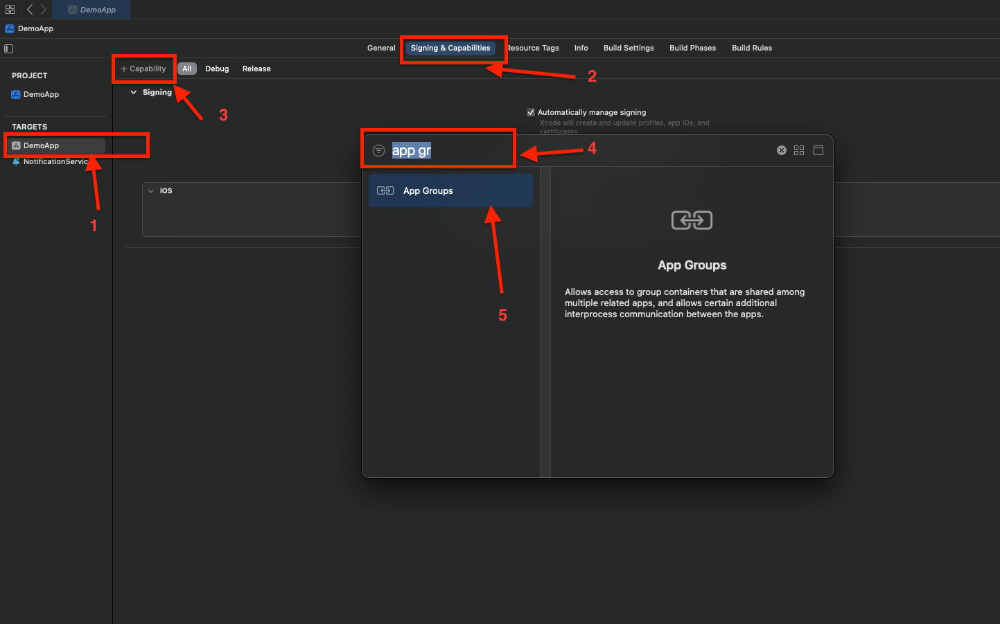
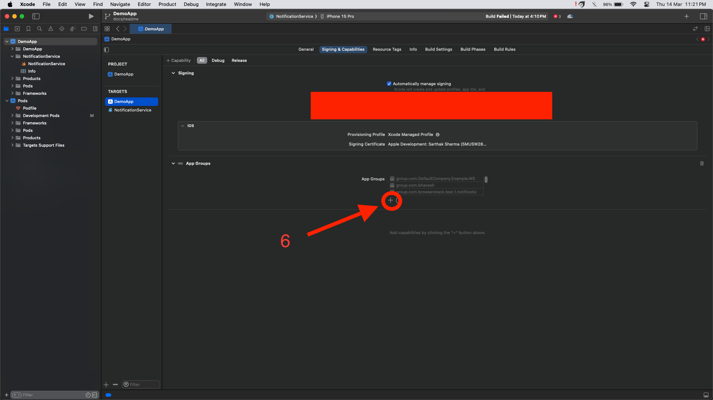
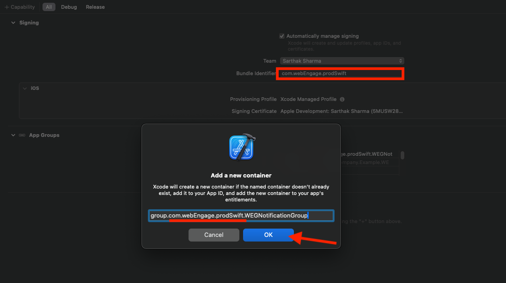

# WEContentExtension

[](https://cocoapods.org/pods/WEContentExtension)
[](/LICENSE.txt)
[](http://cocoapods.org/pods/WEContentExtension)
[](https://cocoapods.org/pods/WEContentExtension)

# WEContentExtension

WEContentExtension is extension SDK on WebEngage to support Rich push layouts inside iOS Applications

## <!-- Start table -->

### Table of Content

<details>
    <summary>Click to Expand</summary>

- [Create content extension for Project](#step-1--create-content-extension-for-project)
- [Integrate WEContentExtension inside Content Extension](#step-2--integrate-webengage-inside-contentextension)
  - [Approach 1 : SPM](#approach-1--integrating-via-spm)
  - [Approach 2 : Cocoapods](#approach-2--integrating-via-cocoapods)
- [Import and Use the WebEngage inside Content Extension](#step-3--import-and-use-the-webengage-inside-content-extension)

  - [Swift](#swift)
  - [Objective C](#objective-c)

- [Configure ContentExtension-Info.plist](#step-4--configure-contentextension-infoplist)
- [Configure App Groups](#step-5--create-app-groups-for-all-targets)
- [Build and Test](#step-6--build-and-test)

 </details>
<!-- End table -->

## Prerequisites

- WebEngage SDK needs to be integrated inside project
- Basic knowledge of Service Extension and Content Extension
- Basic knowledge about push notification , swift / Objc Programing Langage

---

- ## **_Step 1 :_** Create content extension for Project

  This guide provides step-by-step instructions for integrating a content extension into your iOS project. Content extensions allow you to extend the functionality of your app by providing additional content that can be displayed in various contexts, such as the Today view or Messages app.

  - Open your Xcode project.

  - From the menu, select `File` > `New` > `Target...`.

  - Choose `App Extension` from the list of templates.

  - Select the type of extension you want to create (e.g., ContentExtension).

  - Provide a name for your extension and click `Finish`.

  - #### **_Screenshots_**

    <p align="center">
      
    </p>
    <h5 align="center">Screenshot 1</h5>

    <p align="center">
      
    </p>
    <h5 align="center">Screenshot 2</h5>

    <p align="center">
      
    </p>
    <h5 align="center">Screenshot 3</h5>

    <p align="center">
      
    </p>
    <h5 align="center">Screenshot 4</h5>

  ***

- ### **_Step 2 :_** Integrate WebEngage inside ContentExtension

  There are 2 common methods for integrating a library inside a Content Extension:

  ### Note: Choose Either SPM or CocoaPods

  _It's recommended to choose either Swift Package Manager or CocoaPods for integrating the library into your Content Extension. Mixing both methods might lead to conflicts or inconsistencies in your project setup._

  ***

  ### **<u>Approach 1</u> :** Integrating via **_SPM_**

  - ##### Add Package Dependency

    1. Navigate to `File` > `Swift Packages` > `Add Package Dependency...`.
    <br><br>
      <p align="center">
        
      </p>
      <h5 align="center">Screenshot 1 (SPM)</h5>

    2. Enter the URL of the library's repository: `https://github.com/WebEngage/WEContentExtension`.

    3. Click `Next`.

    4. Select the branch to use or enter a specific branch requirement (master).

    5. Click `Next`.
    <br><br>
      <p align="center">
        
      </p>
      <h5 align="center">Screenshot 2 (SPM)</h5>

    6. Choose the target to which you want to add the dependency, i.e., your Content Extension target.

    7. Click `Finish`.
    <br><br>
      <p align="center">
        
      </p>
      <h5 align="center">Screenshot 3 (SPM)</h5>

  ***

    <h5 align="center">OR</h5>

  ***

  ### **<u>Approach 2</u> :** Integrating via **_CocoaPods_**

  - #### Prerequisites

    - Cocoapods should be installed inside your system

    - podfile should be available for your project

  - #### Edit Podfile

    - Open the Podfile using a text editor.

    - Add the library dependency to the Podfile. For example:
      ```ruby
      # this target name should be your ContentExtension Name
      target 'ContentExtension' do
        pod 'WEContentExtension'
      end
      ```
      Note : Your target name should be the Content Extension name which you have entered while creating ContentExtension, Over here refer screenshot 3

  - #### Install Pods

    - Save the changes to the Podfile.

    - Install the pods by running the following command:
      ```shell
      pod install
      ```

---

- ### **_Step 3 :_** Import and Use the WebEngage inside Content Extension

  - #### SWIFT

    1. Open **NotificationViewController.swift**

    2. Import WEContentExtension by adding code `import WEContentExtension`

    3. Remove all existing code from the class `NotificationViewController`

    4. Add subclassing to `NotificationViewController` with `WEXRichPushNotificationViewController`

      <br>

    `NotificationViewController.swift` will look like above below code snippet

    ```swift
    import UIKit
    import UserNotifications
    import UserNotificationsUI

    // Import WebEngage Extension SDK
    import WEContentExtension

    // Subclassing current class with WebEngage provided class
    class NotificationViewController: WEXRichPushNotificationViewController {

        // remove all existing code inside this class

    }
    ```

  - #### Objective C

    1. Open **NotificationViewController.m**

    2. Import `WEContentExtension`

    3. Create Object of `WEContentExtension`

    4. Pass necessary information to `WebEngage` through above created object

    `NotificationViewController.m` will look like above below code snippet

    ```Objective-C
    #import "NotificationViewController.h"
    #import <UserNotifications/UserNotifications.h>
    #import <UserNotificationsUI/UserNotificationsUI.h>

    // Step 1 : Importing WEContentExtension
    #import <WEContentExtension/WEContentExtension-Swift.h>

    @interface NotificationViewController () <UNNotificationContentExtension>

    @property IBOutlet UILabel *label;
    // Step 2 : Creating Object of content Extension
    @property WEXRichPushNotificationViewController *weRichPushVC;

    @end

    @implementation NotificationViewController

    // Step 3 : Pass necessary information to WebEngage
    - (void)viewDidLoad {
        if (_weRichPushVC == NULL){
            _weRichPushVC = [[WEXRichPushNotificationViewController alloc]init];
        }
        [_weRichPushVC setUpViewsWithParentVC:self];
        [super viewDidLoad];

    }

    - (void)didReceiveNotification:(UNNotification *)notification {
        [_weRichPushVC didReceiveNotification:notification];
    }

    - (void)didReceiveNotificationResponse:(UNNotificationResponse *)response completionHandler:(void (^)(UNNotificationContentExtensionResponseOption))completion{
        [_weRichPushVC didReceiveNotificationResponse:response completionHandler:completion];
    }
    @end
    ```

---

- ### **_Step 4 :_** Configure ContentExtension-Info.plist

  Here's how you can go about it:

  - Open the `Info.plist` file for `NotificationViewController`

  - Expand `NSExtension` > `NSExtensionAttributes`

  - Look for UNNotificationExtensionCategory under `NSExtensionAttributes`. Add it if it is not present and set the type as Array In the Array items, add:

    - WEG_CAROUSEL_V1
    - WEG_RATING_V1
    - WEG_RICH_V1
    - WEG_RICH_V2
    - WEG_RICH_V3
    - WEG_RICH_V4
    - WEG_RICH_V5
    - WEG_RICH_V6
    - WEG_RICH_V7
    - WEG_RICH_V8

  - Set `UNNotificationExtensionDefaultContentHidden` under `NSExtensionAttributes` to `YES`

  - Add App Transport Security Settings key under Information Property List in NotificationViewController `Info.plist` files. Set Allow Arbitrary Loads to `YES` under App Transport Security Settings in both these files.

    (Note : Above step Not required if you are sure that image URLs provided for push on WebEngage dashboard will always use https.)

  - Source code snippet for `Info.plist`

    ```xml
        <key>NSExtension</key>
        <dict>
          <key>NSExtensionAttributes</key>
          <dict>
            <key>UNNotificationExtensionCategory</key>
            <array>
              <string>WEG_CAROUSEL_V1</string>
              <string>WEG_RATING_V1</string>
              <string>WEG_RICH_V1</string>
              <string>WEG_RICH_V2</string>
              <string>WEG_RICH_V3</string>
              <string>WEG_RICH_V4</string>
              <string>WEG_RICH_V5</string>
              <string>WEG_RICH_V6</string>
              <string>WEG_RICH_V7</string>
              <string>WEG_RICH_V8</string>
            </array>
            <key>UNNotificationExtensionDefaultContentHidden</key>
            <true/>
            <key>UNNotificationExtensionInitialContentSizeRatio</key>
            <real>1</real>
          </dict>
          <key>NSExtensionMainStoryboard</key>
          <string>MainInterface</string>
          <key>NSExtensionPointIdentifier</key>
          <string>com.apple.usernotifications.content-extension</string>
        </dict>
    ```

    <br><br>

  - `Info.plist` shoul look like below screenshot
    <br><br>
    <p align="center">
      
    </p>
    <h5 align="center">info.plist</h5>

---

- ### **_Step 5 :_** Create App Groups for all Targets

  App Groups allow your app and the WebEngageNotificationContentExtension to communicate when a notification is received, even if your app is not active. This is required for Confirmed Deliveries.

  - Select your `Main App Target` > `Signing & Capabilitie`s > `+ Capability` > `App Groups`.
  - Within `App Groups`, click the `+` button.
  - Set the App Groups container to be `group.YOUR_BUNDLE_IDENTIFIER.WEGNotificationGroup` where `YOUR_BUNDLE_IDENTIFIER` is the same as your Main Application "`Bundle Identifier`".
  - Press `OK` and repeat for the **`NotificationViewController`** Target.
  - #### **_Screenshots_**
    <br><br>
      <p align="center">
      
      </p>
      <h5 align="center">Screenshot 1</h5>
      <br><br>
      <p align="center">
      
      </p>
      <h5 align="center">Screenshot 2</h5>
      <br><br>
      <p align="center">
      
      </p>
      <h5 align="center">Screenshot 3</h5>

---

- ### **_Step 6 :_** Build and Test

  - Build your project to ensure that the library integrates successfully.

  - Test your Content Extension to ensure that it functions as expected with the integrated library.

---

## License

WEContentExtension is available under the MIT license. See the LICENSE file for more info.
