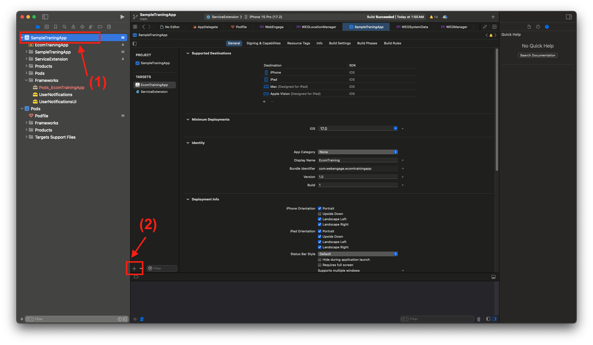
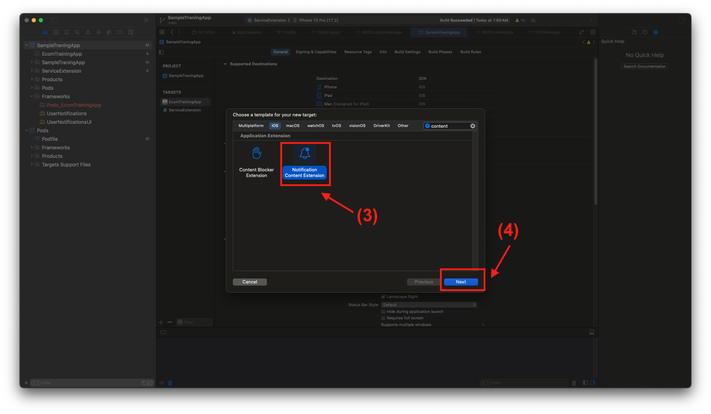
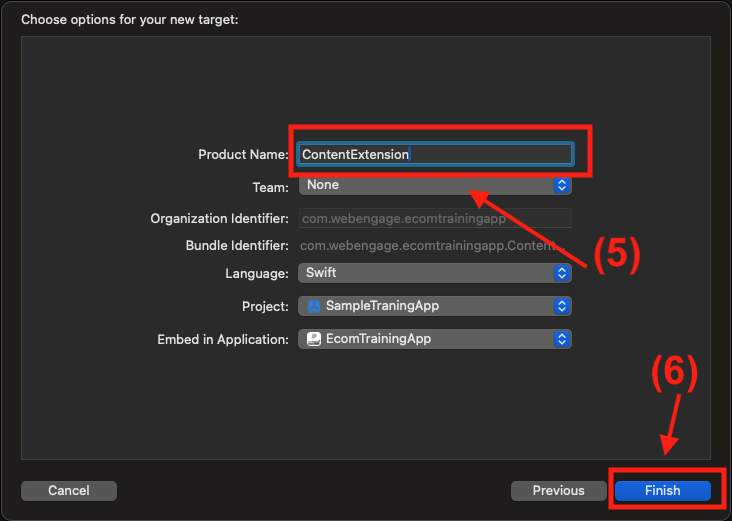
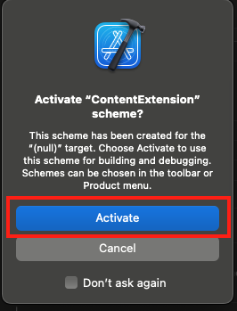
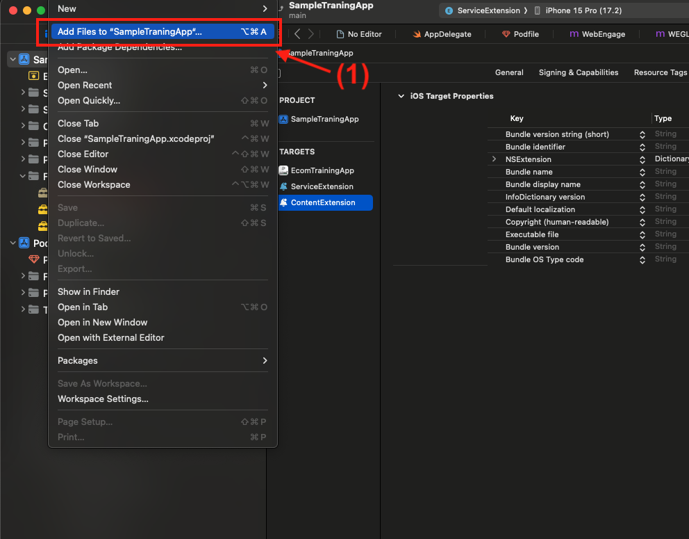
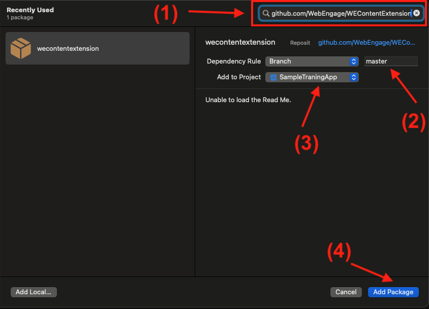
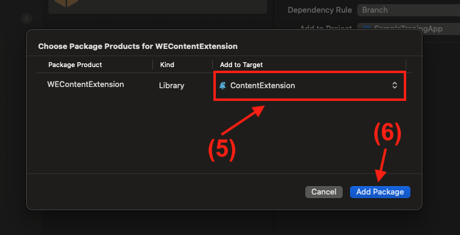
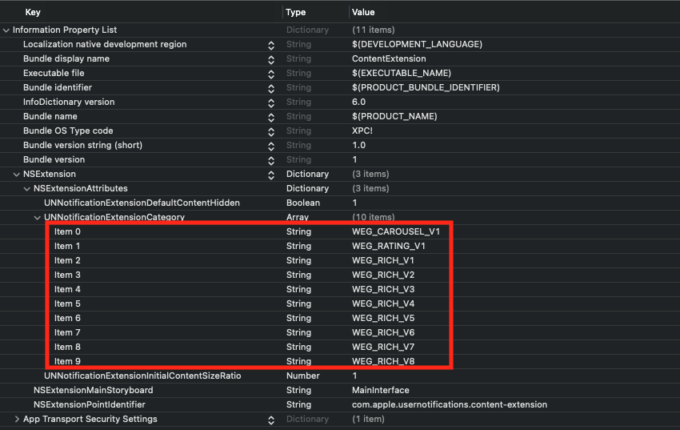
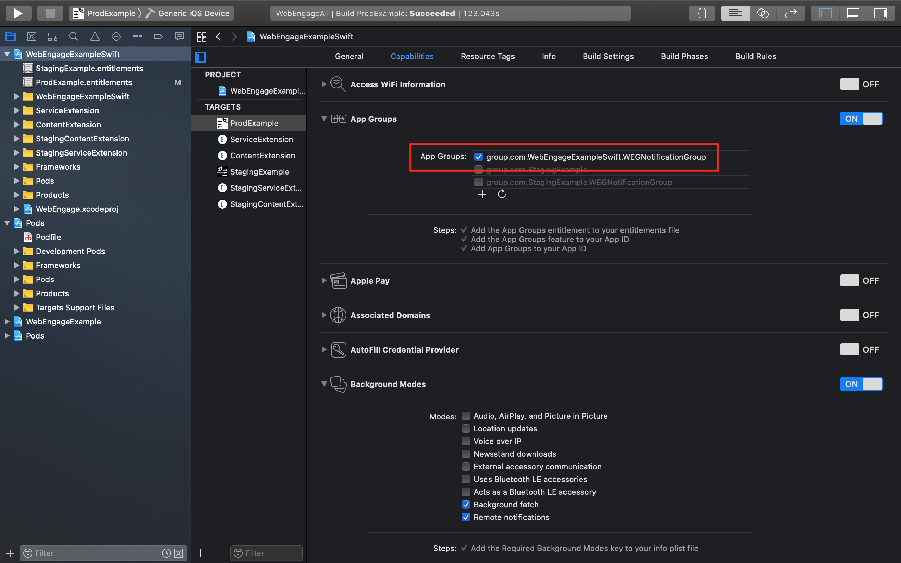

# WEContentExtension

[](https://travis-ci.org/BhaveshWebEngage/WEContentExtension)
[](https://cocoapods.org/pods/WEContentExtension)
[](/LICENSE.txt)
[](https://cocoapods.org/pods/WEContentExtension)

# WEContentExtension
WEContentExtension is extension SDK on WebEngage to support Rich push layouts inside iOS Applications


## <!-- Start table -->

### Table of Content

<details>
    <summary>Click to Expand</summary>

- [Create content extension for Project](#step-1--create-content-extension-for-project)
- [Integrate WEContentExtension inside Content Extension](#step-2--integrate-webengage-inside-contentextension)
  - [Approach 1 : SPM](#approach-1--integrating-via-spm)
  - [Approach 2 : Cocoapods](#approach-2--integrating-via-cocoapods)
- [Import and Use the WebEngage inside Content Extension](#step-3--import-and-use-the-webengage-inside-content-extension)

  - [Swift](#swift)
  - [Objective C](#objective-c)

- [Configure ContentExtension-Info.plist](#step-4--configure-contentextension-infoplist)
- [Configure App Groups](#step-5--create-app-groups-for-all-targets)

 </details>
<!-- End table -->

## Prerequisites

- WebEngage SDK needs to be integrated inside project
- Basic knowledge of Service Extension and Content Extension
- Basic knowledge about push notification , swift / Objc Programing Langage

---
- ## ***Step 1 :*** Create content extension for Project
  This guide provides step-by-step instructions for integrating a content extension into your iOS project. Content extensions allow you to extend the functionality of your app by providing additional content that can be displayed in various contexts, such as the Today view or Messages app.

    
    - Open your Xcode project.
    
    - From the menu, select `File` > `New` > `Target...`.
    
    - Choose `App Extension` from the list of templates.
    
    - Select the type of extension you want to create (e.g., ContentExtension).
    
    - Provide a name for your extension and click `Finish`.
    
    - #### ***Screenshots***
      <p align="center">
        
      </p>
      <h5 align="center">Screenshot 1</h5>


      <p align="center">
        
      </p>
      <h5 align="center">Screenshot 2</h5>

      <p align="center">
        
      </p>
      <h5 align="center">Screenshot 3</h5>

      <p align="center">
        
      </p>
      <h5 align="center">Screenshot 4</h5>


  ---
- ### ***Step 2 :*** Integrate WebEngage inside ContentExtension 
  There are 2 common methods for integrating a library inside a Content Extension:

  ### Note: Choose Either SPM or CocoaPods
   *It's recommended to choose either Swift Package Manager or CocoaPods for integrating the library into your Content Extension. Mixing both methods might lead to conflicts or inconsistencies in your project setup.*

  ---
  ### **<u>Approach 1</u> :** Integrating via ***SPM***
  - ##### Add Package Dependency
      1. Navigate to `File` > `Swift Packages` > `Add Package Dependency...`.
        <br><br>
          <p align="center">
            
          </p>
          <h5 align="center">Screenshot 1 (SPM)</h5>

      2. Enter the URL of the library's repository: `https://github.com/WebEngage/WEContentExtension`. 

      3. Click `Next`. 

      4. Select the branch to use or enter a specific branch requirement (master). 

      5. Click `Next`.
        <br><br>
          <p align="center">
            
          </p>
          <h5 align="center">Screenshot 2 (SPM)</h5>

      6. Choose the target to which you want to add the dependency, i.e., your Content Extension target. 
      
      7. Click `Finish`.
        <br><br>
          <p align="center">
            
          </p>
          <h5 align="center">Screenshot 3 (SPM)</h5>

  ---
    
    <h5 align="center">OR</h5>

  ---

  ### **<u>Approach 2</u> :** Integrating via ***CocoaPods***

    - #### Prerequisites

      - Cocoapods should be installed inside your system

      - podfile should be available for your project

    - #### Edit Podfile
      - Open the Podfile using a text editor.

      - Add the library dependency to the Podfile. For example:
        ```ruby
        # this target name should be your ContentExtension Name
        target 'ContentExtension' do 
          pod 'WEContentExtension'
        end
        ```
        Note : Your target name should be the Content Extension name which you have entered while creating ContentExtension, Over here refer screenshot 3

    - #### Install Pods
      - Save the changes to the Podfile.

      - Install the pods by running the following command:
        ```shell
        pod install
        ```
---

- ### ***Step 3 :*** Import and Use the WebEngage inside Content Extension 

  - #### SWIFT

    1. Open **NotificationViewController.swift**

    2. Import WEContentExtension by adding code `import WEContentExtension`

    3. Remove all existing code from the class `NotificationViewController`
    
    4. Add subclassing to `NotificationViewController` with `WEXRichPushNotificationViewController`

      <br>

      `NotificationViewController.swift` will look like above below code snippet

          ```swift
          
          import UIKit
          import UserNotifications
          import UserNotificationsUI

          // Import WebEngage Extension SDK
          import WEContentExtension

          // Subclassing current class with WebEngage provided class
          class NotificationViewController: WEXRichPushNotificationViewController {

              // remove all existing code inside this class
              
          }
          ```
---          
- ### ***Step 4 :*** Configure ContentExtension-Info.plist

    Here's how you can go about it:
    
    - Open the `Info.plist` file for `NotificationViewController`
    
    - Expand `NSExtension` > `NSExtensionAttributes`

    - Look for UNNotificationExtensionCategory under `NSExtensionAttributes`. Add it if it is not present and set the type as Array In the Array items, add:

      - WEG_CAROUSEL_V1
      - WEG_RATING_V1
      - WEG_RICH_V1
      - WEG_RICH_V2
      - WEG_RICH_V3
      - WEG_RICH_V4
      - WEG_RICH_V5
      - WEG_RICH_V6
      - WEG_RICH_V7
      - WEG_RICH_V8

    - Set `UNNotificationExtensionDefaultContentHidden` under `NSExtensionAttributes` to `YES`

    - Add App Transport Security Settings key under Information Property List in NotificationViewController `Info.plist` files. Set Allow Arbitrary Loads to `YES` under App Transport Security Settings in both these files.

      (Note : Above step Not required if you are sure that image URLs provided for push on WebEngage dashboard will always use https.)
      
    - Source code snippet for `Info.plist`

      ```xml
          <key>NSExtension</key>
          <dict>
            <key>NSExtensionAttributes</key>
            <dict>
              <key>UNNotificationExtensionCategory</key>
              <array>
                <string>WEG_CAROUSEL_V1</string>
                <string>WEG_RATING_V1</string>
                <string>WEG_RICH_V1</string>
                <string>WEG_RICH_V2</string>
                <string>WEG_RICH_V3</string>
                <string>WEG_RICH_V4</string>
                <string>WEG_RICH_V5</string>
                <string>WEG_RICH_V6</string>
                <string>WEG_RICH_V7</string>
                <string>WEG_RICH_V8</string>
              </array>
              <key>UNNotificationExtensionDefaultContentHidden</key>
              <true/>
              <key>UNNotificationExtensionInitialContentSizeRatio</key>
              <real>1</real>
            </dict>
            <key>NSExtensionMainStoryboard</key>
            <string>MainInterface</string>
            <key>NSExtensionPointIdentifier</key>
            <string>com.apple.usernotifications.content-extension</string>
          </dict>
      ```
      <br><br>
    - `Info.plist` shoul look like below screenshot
      <br><br>
      <p align="center">
        
      </p>
      <h5 align="center">info.plist</h5>
---      
- ### ***Step 5 :*** Create App Groups for all Targets
  Here's how you can go about it:

  - Step 1: Enter Project Navigator view.

  - Step 2: Select your main app target from the expanded sidebar or from the dropdown menu, then select the Capabilities tab.

  - Step 3: If App Groups isn't enabled, click the switch to add the "App Groups" entitlement to your app. If you are using Xcode 8 or above, ensure that an YOUR-APP-NAME.entitlements file has been added to your project.

  - Step 4: Add an App Group container and specify its name. We recommend using this format: group.<your-bundle-identifier>.WEGNotificationGroup. Make sure this App Group is in use by ticking the checkbox against it.

  - Step 5: Select the NotificationService target from the expanded sidebar or from the dropdown menu, then select the Capabilities tab. Click on the checkbox against the added App Group and tick it.

  - Step 6: Do the same for NotificationViewController target. Select the NotificationViewController target from the expanded sidebar or from the dropdown menu, then select the Capabilities tab. Click on the checkbox against the added App Group and tick it.

      <br><br>
      <p align="center">
        
      </p>
      <h5 align="center">App Group config</h5>

---
- ### Step 4: Build and Test

  - Build your project to ensure that the library integrates successfully.

  - Test your Content Extension to ensure that it functions as expected with the integrated library.


## Author

WebEngage

## License

WEContentExtension is available under the MIT license. See the LICENSE file for more info.
